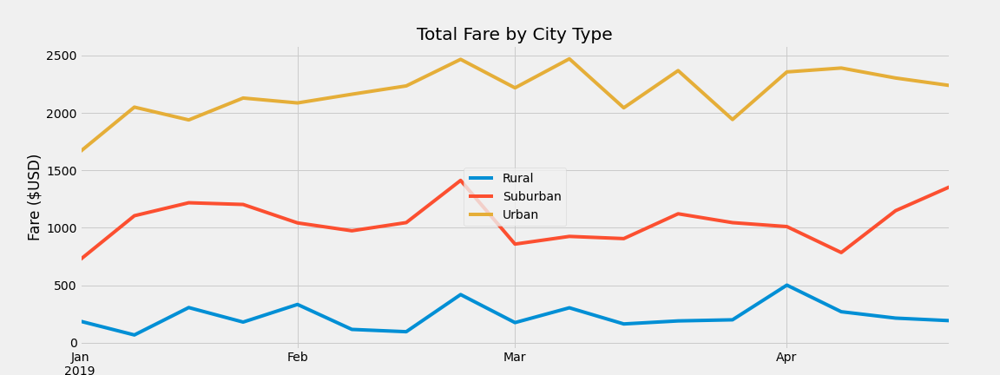

# PyBer Ride-Sharing Fares for Rural, Suburban and Urban Analysis

    Overview of the Analysis

The purpose of this analysis is to use Python and Pandas to create a summary DataFrame of the ride-sharing data by city type provided through our liason, Omar, at PyBer. Then, using Pandas and Matplotlib, I created a multiple-line graph that shows the total weekly fares for each city type (Rural, Suburban and Urban). Finally, in this written report I will summarize how the first quarter data differs by city type and how those differences can be used by PyBer to address disparities and prepare for a more profitable future.

    Deliverables for this Analysis
 
 This assignment consists of two technical analysis deliverables: 
    1) A ride-sharing summary DataFrame by city type, and 
    2) A multiple-line chart of total fares for each city type.

