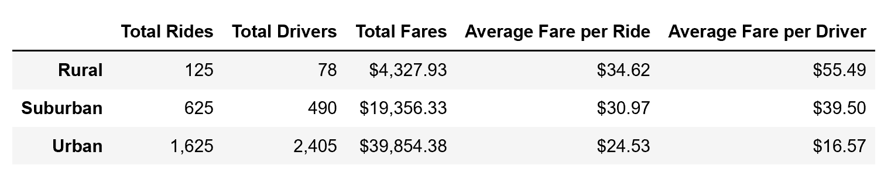

# PyBer Ridesharing Fares for Rural, Suburban and Urban Analysis

Overview of the Analysis

The purpose of this analysis is to use Python and Pandas to create a summary DataFrame of the ride-sharing data by city type provided through our liason, Omar, at PyBer. Then, using Pandas and Matplotlib, I created a multiple-line graph that shows the total weekly fares for each city type (Rural, Suburban and Urban). Finally, in this written report I will summarize how the first quarter data differs by city type and how those differences can be used by PyBer to address disparities and prepare for a more profitable future.

  Project Deliverables
 
This analysis consists of two technical deliverables: 
1) A ride-sharing summary DataFrame by city type that I will refer to as Figure 1
    

    
    
2) A multiple-line chart of total fares for each city type that i wil refer to as Figure 2
    
 

    
    
    

Results of Analysis
 
The data collected thru the first quarter rideshares of 2019 provides a glimpse into the differences between the three city types illustrated in Figures 1. In the first column, Total Rides, I beleive it is clear to see that the overwhelming majority of Total Rides(2405 of 2973, 81%) take place in the Urban setting. Based on the current rideshare structure it can be inferred that more drivers are needed to service more rides in the more densely populated Urban area. Yet, while there are fewer "Total Rides" and "Total Drivers" in the Rural area, the "Average Fare per Ride" and "Average Fare per Driver" are significantly higher than those in the Urban area. The "Total Fares" is significantly higher in the Urban area, but the Urban area is the only area of the three where the "Average Fare per Driver" is below the "Average Fare per Ride" representing a negative effect on revenue for employing more Urban drivers.

  
  For Better Analysis

I believe there needs to be a larger sample of data provided over at least one full calendar year to make acurate predictions about future ridesharing trends for PyBer. Seasons of the year, weather patterns, personal expendable income and the development of trust among clientel are necessary to make appropriate judgements. Also, I would recommend analyzing the percentages of each of the city types to better understand future emphasis of business resources.   
  
 

Summary

I will offer three recommendations for addressing disparities among the city types.
1.) One difference among the three city types, as seen in Figure 2, is the sharp peaks and valleys in the Urban and Suburban areas as compared to the more consistent increase of rides throughout the quarter for the Rural area. Weather plays an important role in forming habits. The disparity in the decrease of rides may have to do with weather condtions and the increase of commute times in the Urban area.
2.) I would recommend using Web based or Web/App based technology to better understand how the three city types are being used by riders. Is there a way for drivers to mkae more 'pickups' on their way to a destination? If the driver's destination is known, Web based technology can be used to match a driver with a rider who is headed in the same dircetion with a manageable route. 
3.) Finally, I recommend looking into how partnerships can be formed with local Urban businesses to provide corporate rideshare programs for employees who live in the Suburban and Rural areas in particular. Urban workers tend to walk much more to desired locations than those who are living in outlying areas. I would also recommend looking at increasing the size of vehicles that are used in the Urban and Rural areas to better use company resources when increasing the number of riders per fare. 
 
this concludes the Pyber analysis pem

